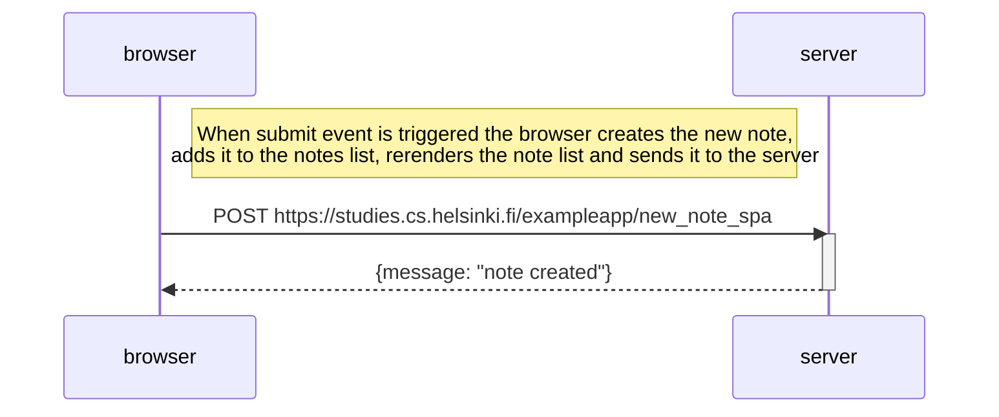

```mermaid
sequenceDiagram
    participant browser
    participant server

    Note right of browser: When submit event is triggered the browser creates the new note, <br> adds it to the notes list, rerenders the note list and sends it to the server

    browser->>server: POST https://studies.cs.helsinki.fi/exampleapp/new_note_spa
    activate server
    server-->>browser:  {message: "note created"}
    deactivate server

```